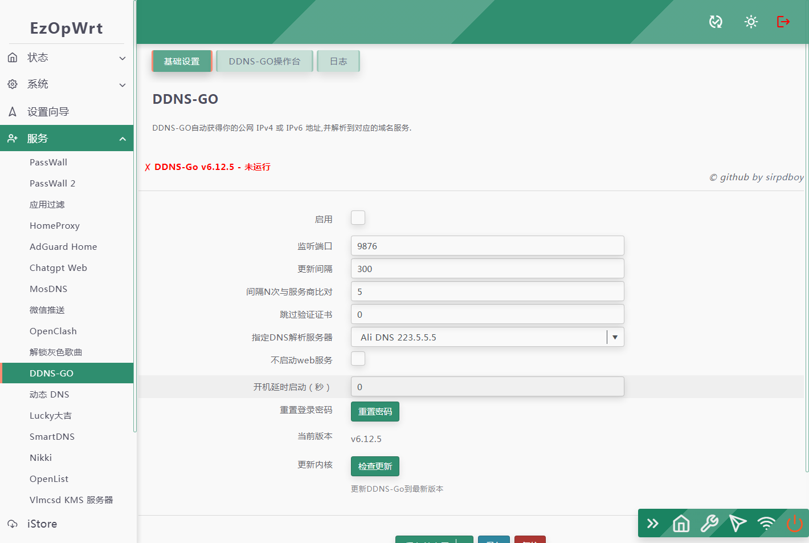
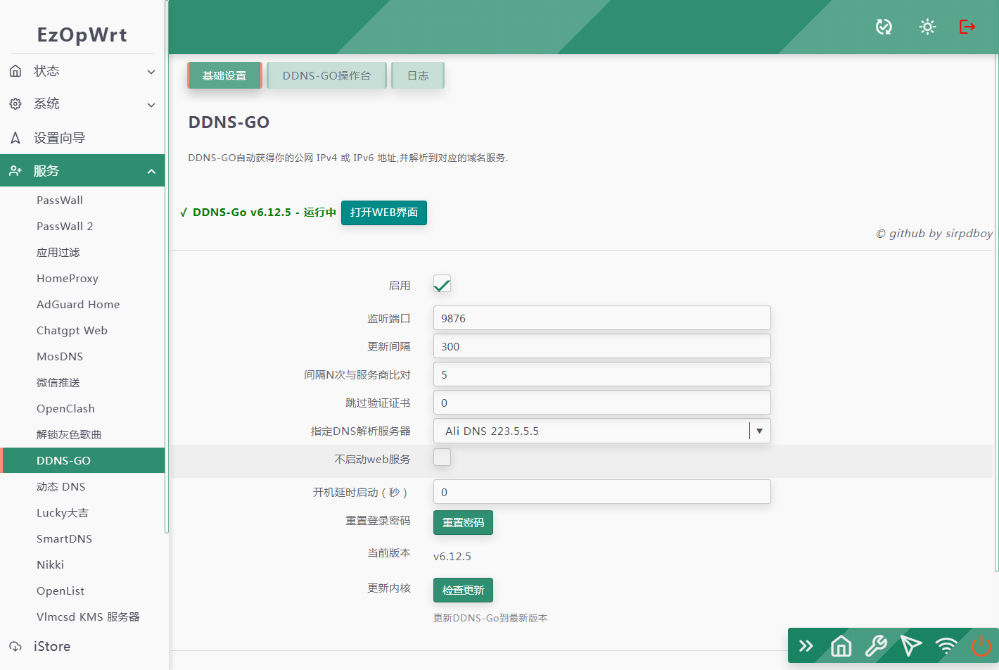
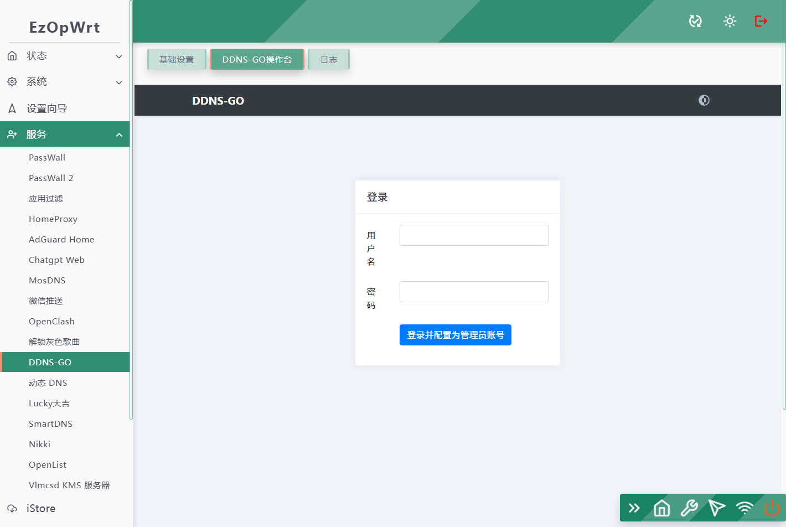

 [](https://t.me/joinchat/AAAAAEpRF88NfOK5vBXGBQ)

<h1 align="center">
  <br>DDNS GO<br>
</h1>

  <p align="center">

  <a target="_blank" href="https://github.com/sirpdboy/luci-app-ddns-go/releases">
    
  </a>
</p>

[中文](README_CN.md) | English


Please read this page carefully, which includes precautions and instructions on how to use it.

## Function Description:

### Ddns go dynamic domain plugin
#### Automatically obtain your public IPv4 or IPv6 address and resolve it to the corresponding domain name service.


## release note

## 2025.5.14  luci-app-ddns-go 1.5.2
## 2025.5.12  luci-app-ddns-go 1.5.1
- Update log:
- Compatible with the latest OPENWRT24.10, JS version. The old version 18.06 uses LUA branch.


## characteristic

- Supports Mac, Windows, Linux systems, ARM, x86 architecture
- Supported Domain Name Service Providers: AliDNS, Dnpod, Cloudflare, Huawei Cloud, callbacks, Baidu Cloud, porkbun, GoDaddy`
- Support interface/network card to obtain IP
- Support running as a service
- Default synchronization interval of 5 minutes
- Supporting simultaneous resolution of multiple domain names, a must-have for companies
- Support multi-level domain names
- Configure on the webpage, simple and convenient, can set 'login username and password'/'prohibit access from the public network'`
- Convenient and quick viewing of the last 50 logs on the webpage, without the need to run Docker to view them
- Support webhook notifications
- Supports TTL
- Support some DNS service providers to pass custom parameters and achieve functions such as region resolution

## Usage

Method for adding luci-app-ddns-go to LEDE/OpenWRT source code.

### Method for downloading source code one:
Edit the root directory of the source code folder 'feeds.comnf.defect' and add the following content:

```Brach
    # feeds Get source code：
    src-git taskplan  https://github.com/sirpdboy/luci-app-ddns-go
 ``` 
  ```Brach
   # Update feeds and install themes:
    scripts/feeds update ddns-go
	scripts/feeds install luci-app-ddns-go
 ``` 	

### Method for downloading source code two:
 ```Brach
    # downloading
    git clone https://github.com/sirpdboy/luci-app-ddns-go package/ddns-go
    make menuconfig
 ``` 
### Configuration Menu
 ```Brach
    make menuconfig
	# find LuCI -> Applications, select luci-app-ddns-go, save and exit
 ``` 
### compile
 ```Brach 
    # compile
    make package/ddns-go/luci-app-ddns-go/compile V=s
 ```


## describe

- Source code source：https://github.com/sirpdboy/luci-app-ddns-go
- Source code source：https://github.com/jeessy2/ddns-go.git


## interface








# My other project

- Watch Dog ： https://github.com/sirpdboy/luci-app-watchdog
- Net Speedtest ： https://github.com/sirpdboy/luci-app-netspeedtest
- Task Plan : https://github.com/sirpdboy/luci-app-taskplan
- Power Off Device : https://github.com/sirpdboy/luci-app-poweroffdevice
- OpentoPD Theme : https://github.com/sirpdboy/luci-theme-opentopd
- Ku Cat Theme : https://github.com/sirpdboy/luci-theme-kucat
- Ku Cat Theme Config : https://github.com/sirpdboy/luci-app-kucat-config
- NFT Time Control : https://github.com/sirpdboy/luci-app-timecontrol
- Parent Control: https://github.com/sirpdboy/luci-theme-parentcontrol
- Eqos Plus: https://github.com/sirpdboy/luci-app-eqosplus
- Advanced : https://github.com/sirpdboy/luci-app-advanced
- ddns-go : https://github.com/sirpdboy/luci-app-ddns-go
- Advanced Plus）: https://github.com/sirpdboy/luci-app-advancedplus
- Net Wizard: https://github.com/sirpdboy/luci-app-netwizard
- Part Exp: https://github.com/sirpdboy/luci-app-partexp
- Lukcy: https://github.com/sirpdboy/luci-app-lukcy

## HELP

|       |    | 
| :-----------------: | :-------------: |
| |  |

<a href="#readme">
    
</a>

 [](https://t.me/joinchat/AAAAAEpRF88NfOK5vBXGBQ)
